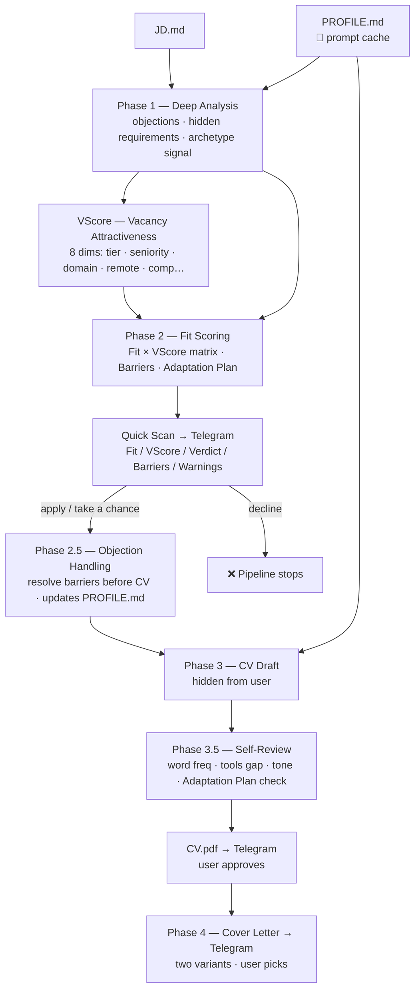

# AI Pipeline

Six-phase Claude API pipeline. All static system content — `PROFILE.md` and every phase prompt — is prompt-cached; only per-vacancy text (JD + prior-phase output) is charged at full rate.

Phase prompts are **skill-type-specific**: `PROFILE.md` carries a `skill_type` field (e.g. `pm`, `generic`) that routes all phases to `prompts/[skill_type]/`.

**3-way verdict:** `apply` · `take a chance` · `decline` — driven by Fit × VScore matrix  
**VScore (1–10):** vacancy attractiveness — company tier, seniority, market scope, domain fit, remote policy, compensation  
**Fit Breakdown:** per-requirement ✅/⚠️/❌ — pet-projects never equal commercial experience  
**Archetype-aware:** Founder Proxy vs Executor signal → different CV framing per vacancy
