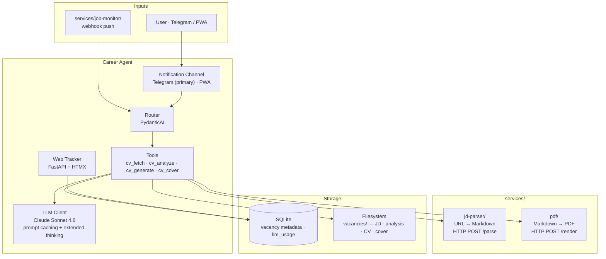

# Architecture

| Layer | Tech |
|-------|------|
| AI | Claude Sonnet 4.6 · PydanticAI · prompt caching (profile + all phase prompts) |
| UI | Telegram (aiogram 3.x) · Web tracker (FastAPI + HTMX) |
| HTTP | httpx async |
| Storage | SQLite + filesystem |
| Deploy | Docker Compose — career-agent · services/ |
