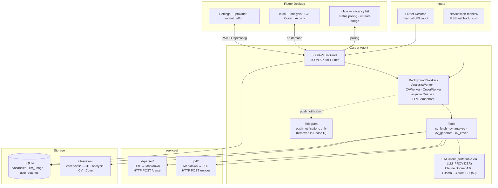

# Architecture

| Layer | Tech |
|-------|------|
| AI | Claude Sonnet 4.6 (default) · Ollama (`LLM_PROVIDER=ollama_api`) · Claude CLI (`LLM_PROVIDER=claude_cli`, $0) · prompt caching |
| UI | Flutter Desktop (primary) · Web tracker (FastAPI + HTMX, read-only) |
| Backend | FastAPI — JSON endpoints for Flutter + background worker orchestration |
| Workers | asyncio.Queue — AnalysisWorker · CVWorker · CoverWorker; shared LLMSemaphore |
| HTTP | httpx async (backend) · http (Flutter) |
| Storage | SQLite + filesystem |
| Deploy | Docker Compose — career-agent · services/ |
