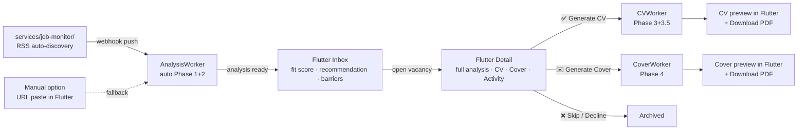

# User Journey

New jobs arrive automatically via RSS and are analyzed in the background. The user only makes decisions — approve or skip — inside the Flutter Desktop app.

**The user's only job:** review the analysis, approve or skip. Everything else runs automatically.
