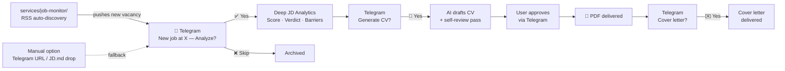

# User Journey

New jobs arrive automatically via RSS. The user only makes decisions — approve or skip.
Manual URL input is a fallback, not the default.

**The user's only job:** approve or skip. Everything else runs automatically.
